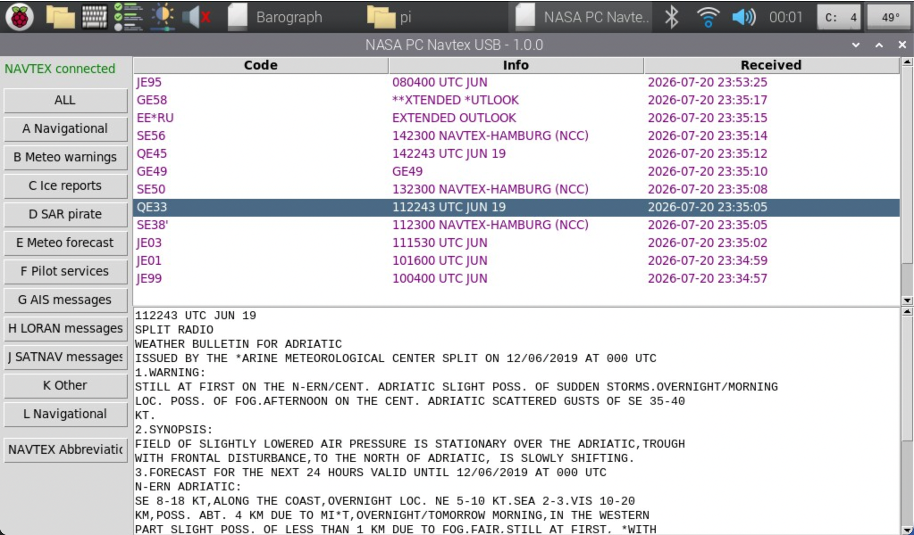

[](https://pypi.org/project/pc-navtex-py/)
[](https://pypi.org/project/pc-navtex-py/)
[](https://github.com/TeaM-TL/pc-navtex-py/actions/workflows/publish_to_pypi.yml?query=workflow%3A%22Build+and+upload+to+PyPI+when+a+Release+is+Created%22)

# pc-navtex-py
GUI for showing messages from NASA PC NAVTEX USB

inspired by [juerec](https://github.com/juerec/pc-navtex)



## Installation and run

### Linux

Install requirements:
```bash
apt-get install python3-pip python3-tk python3-serial
```

Install or upgrade a PyPi package by PIP:
```bash
python3 -m pip install --upgrade pc-navtex-py
```

Run
```bash
pc-navtex-py
```

### macOS

soon will be ready, if USB port will be available to selection
